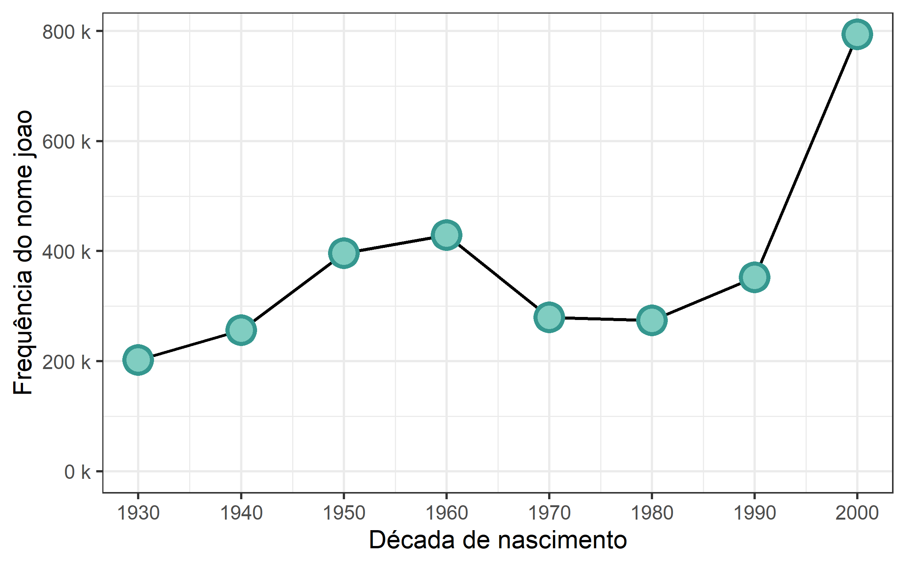
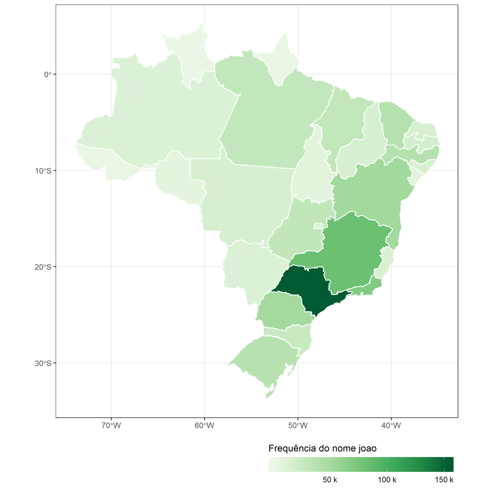
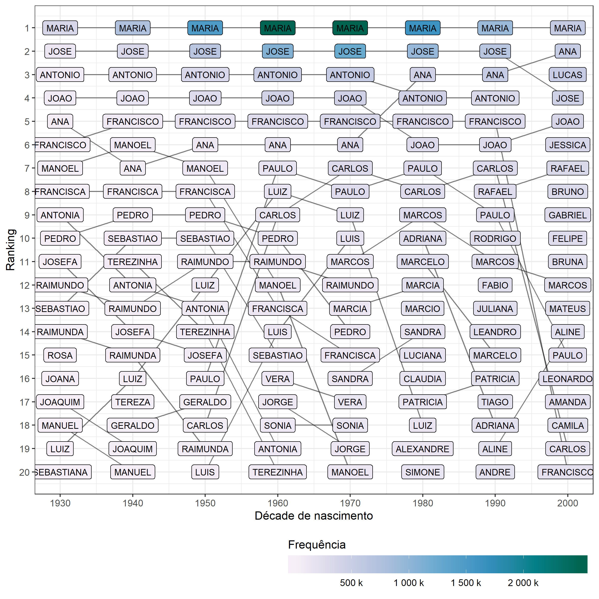

<!-- README.md is generated from README.Rmd. Please edit that file -->

# brnome

<!-- badges: start -->

[]()
[](https://travis-ci.org/italocegatta/brnome)
[](https://ci.appveyor.com/project/italocegatta/brnome)
[](https://codecov.io/gh/italocegatta/brnome?branch=master)

<!-- badges: end -->

The goal of brnome is to …

## Installation

You can install the development version from
[GitHub](https://github.com/) with:

``` r
# install.packages("devtools")
devtools::install_github("italocegatta/brnome")
```

## Example

This is a basic example which shows you how to solve a common problem:

``` r
library(brnome)
library(brmap)
library(tidyverse)

joao_freq <- brnome_freq(nome = "joao")

joao_freq
#> # A tibble: 9 x 7
#>   nome  sexo  localidade_cod localidade_nome nascimento_peri~ nascimento_deca~
#>   <chr> <lgl> <lgl>          <chr>           <chr>                       <int>
#> 1 JOAO  NA    NA             Brasil          [    , 1930]                 1930
#> 2 JOAO  NA    NA             Brasil          [1930, 1940]                 1930
#> 3 JOAO  NA    NA             Brasil          [1940, 1950]                 1940
#> 4 JOAO  NA    NA             Brasil          [1950, 1960]                 1950
#> 5 JOAO  NA    NA             Brasil          [1960, 1970]                 1960
#> 6 JOAO  NA    NA             Brasil          [1970, 1980]                 1970
#> 7 JOAO  NA    NA             Brasil          [1980, 1990]                 1980
#> 8 JOAO  NA    NA             Brasil          [1990, 2000]                 1990
#> 9 JOAO  NA    NA             Brasil          [2000, 2010]                 2000
#> # ... with 1 more variable: frequencia <int>
```

``` r
brnome_freq(nome = "joao", sexo = "m")
#> # A tibble: 9 x 7
#>   nome  sexo  localidade_cod localidade_nome nascimento_peri~ nascimento_deca~
#>   <chr> <chr> <lgl>          <chr>           <chr>                       <int>
#> 1 JOAO  M     NA             Brasil          [    , 1930]                 1930
#> 2 JOAO  M     NA             Brasil          [1930, 1940]                 1930
#> 3 JOAO  M     NA             Brasil          [1940, 1950]                 1940
#> 4 JOAO  M     NA             Brasil          [1950, 1960]                 1950
#> 5 JOAO  M     NA             Brasil          [1960, 1970]                 1960
#> 6 JOAO  M     NA             Brasil          [1970, 1980]                 1970
#> 7 JOAO  M     NA             Brasil          [1980, 1990]                 1980
#> 8 JOAO  M     NA             Brasil          [1990, 2000]                 1990
#> 9 JOAO  M     NA             Brasil          [2000, 2010]                 2000
#> # ... with 1 more variable: frequencia <int>
```

``` r
brnome_freq(nome = "joao", localidade_cod = 5103403)
#> # A tibble: 9 x 7
#>   nome  sexo  localidade_cod localidade_nome nascimento_peri~ nascimento_deca~
#>   <chr> <lgl>          <int> <chr>           <chr>                       <int>
#> 1 JOAO  NA           5103403 Cuiabá          [    , 1930]                 1930
#> 2 JOAO  NA           5103403 Cuiabá          [1930, 1940]                 1930
#> 3 JOAO  NA           5103403 Cuiabá          [1940, 1950]                 1940
#> 4 JOAO  NA           5103403 Cuiabá          [1950, 1960]                 1950
#> 5 JOAO  NA           5103403 Cuiabá          [1960, 1970]                 1960
#> 6 JOAO  NA           5103403 Cuiabá          [1970, 1980]                 1970
#> 7 JOAO  NA           5103403 Cuiabá          [1980, 1990]                 1980
#> 8 JOAO  NA           5103403 Cuiabá          [1990, 2000]                 1990
#> 9 JOAO  NA           5103403 Cuiabá          [2000, 2010]                 2000
#> # ... with 1 more variable: frequencia <int>
```

``` r
brnome_freq(nome = "joao", localidade_cod = 51)
#> # A tibble: 9 x 7
#>   nome  sexo  localidade_cod localidade_nome nascimento_peri~ nascimento_deca~
#>   <chr> <lgl>          <int> <chr>           <chr>                       <int>
#> 1 JOAO  NA                51 Mato Grosso     [    , 1930]                 1930
#> 2 JOAO  NA                51 Mato Grosso     [1930, 1940]                 1930
#> 3 JOAO  NA                51 Mato Grosso     [1940, 1950]                 1940
#> 4 JOAO  NA                51 Mato Grosso     [1950, 1960]                 1950
#> 5 JOAO  NA                51 Mato Grosso     [1960, 1970]                 1960
#> 6 JOAO  NA                51 Mato Grosso     [1970, 1980]                 1970
#> 7 JOAO  NA                51 Mato Grosso     [1980, 1990]                 1980
#> 8 JOAO  NA                51 Mato Grosso     [1990, 2000]                 1990
#> 9 JOAO  NA                51 Mato Grosso     [2000, 2010]                 2000
#> # ... with 1 more variable: frequencia <int>
```

``` r
joao_estado <- localidades %>% 
  filter(tipo == "Estado") %>% 
  mutate(
    freq = map(
      localidade,
      ~brnome_freq(nome = "joao", localidade_cod = .x) 
    )
  ) %>% 
  select(freq) %>% 
  unnest()

joao_estado
#> # A tibble: 243 x 7
#>    nome  sexo  localidade_cod localidade_nome nascimento_peri~ nascimento_deca~
#>    <chr> <lgl>          <int> <chr>           <chr>                       <int>
#>  1 JOAO  NA                11 Rondônia        [    , 1930]                 1930
#>  2 JOAO  NA                11 Rondônia        [1930, 1940]                 1930
#>  3 JOAO  NA                11 Rondônia        [1940, 1950]                 1940
#>  4 JOAO  NA                11 Rondônia        [1950, 1960]                 1950
#>  5 JOAO  NA                11 Rondônia        [1960, 1970]                 1960
#>  6 JOAO  NA                11 Rondônia        [1970, 1980]                 1970
#>  7 JOAO  NA                11 Rondônia        [1980, 1990]                 1980
#>  8 JOAO  NA                11 Rondônia        [1990, 2000]                 1990
#>  9 JOAO  NA                11 Rondônia        [2000, 2010]                 2000
#> 10 JOAO  NA                12 Acre            [    , 1930]                 1930
#> # ... with 233 more rows, and 1 more variable: frequencia <int>
```

``` r
joao_estado %>% 
  group_by(nascimento_decada) %>% 
  summarise(frequencia = sum(frequencia)) %>% 
  ggplot(aes(nascimento_decada, frequencia)) +
    geom_line(size = 1) +
    geom_point(shape = 21, color = "#35978f", fill =  "#80cdc1", size = 7, stroke = 2) +
    labs(x = "Década de nascimento", y = "Frequência do nome joao") +
    scale_x_continuous(breaks = seq(1900, 2020, 10)) + 
    scale_y_continuous(limits = c(0, NA), labels = scales::unit_format(unit = "k", scale = 1e-3)) + 
    theme_bw(16)
```



``` r
joao_estado %>% 
  left_join(brmap_estado_simples, by = c("localidade_nome" = "estado_nome")) %>% 
  st_as_sf() %>% 
  ggplot(aes(fill = frequencia)) +
    geom_sf(color = "white") +
    labs(fill = "Frequência do nome joao") +
    scale_fill_distiller(
      palette = "Greens",
      direction = 1,
      labels = scales::unit_format(unit = "k", scale = 1e-3)
    ) +
    theme_bw() +
    theme(legend.position = "bottom", legend.justification = "right") +
    guides(fill = guide_colorbar(barwidth = 15, title.position = "top"))
```



``` r
rank_decada <- map_dfr(seq(1930, 2000, 10), ~brnome_rank(decada = .x))

rank_decada %>%
  ggplot(aes(decada, ranking, fill = frequencia, label = nome)) +
  geom_line(aes(group = nome), alpha = 0.5) +
  geom_label(color = "black", size = 3) +
  #facet_wrap(~sexo, labeller = labeller(sexo = c("F" = "Feminino", "M" = "Masculino"))) +
  labs(x = "Décade de nascimento", y = "Ranking", fill = "Frequência") +
  scale_x_continuous(breaks = seq(1930, 2000, 10)) +
  scale_y_reverse(breaks = 1:20) +
  scale_fill_distiller(
    palette = "PuBuGn", direction = 1, 
    labels = scales::unit_format(unit = "k", scale = 1e-3)
  ) +
  theme_bw() +
  theme(legend.position = "bottom", legend.justification = "right") +
  guides(fill = guide_colorbar(barwidth = 20, title.position = "top"))
```


